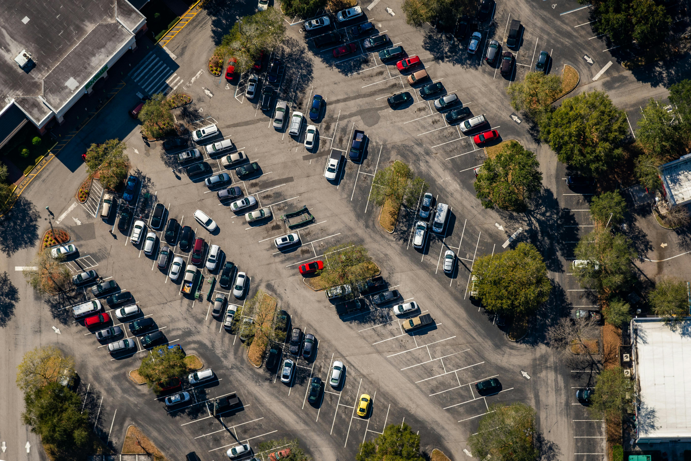
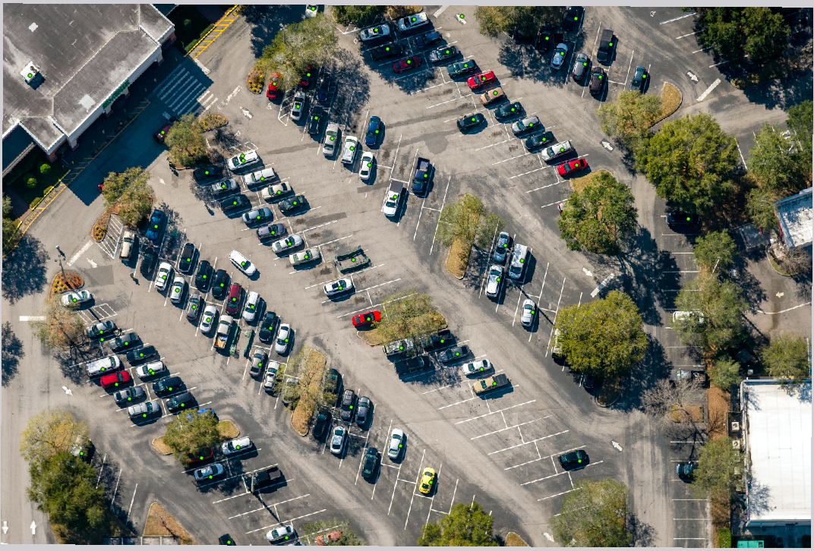
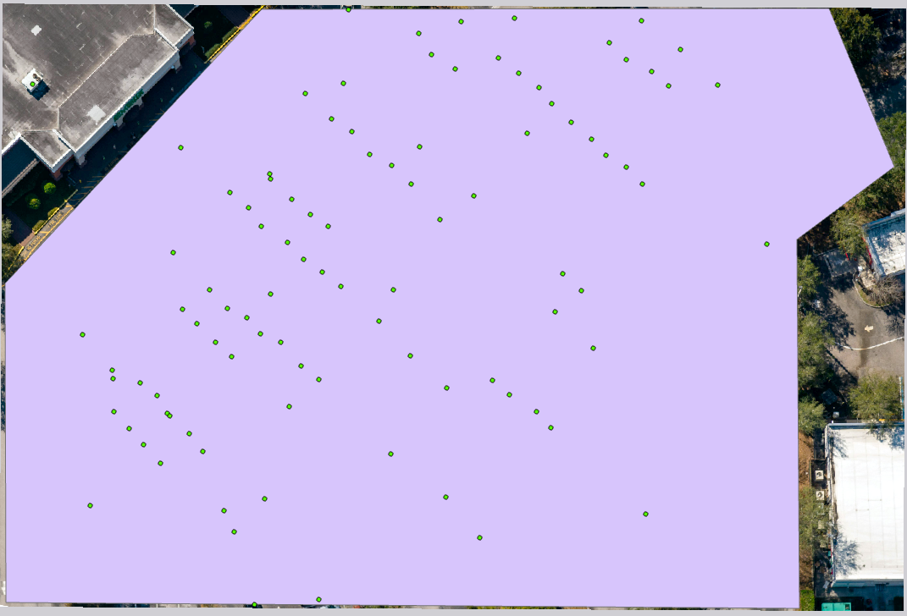

This project builds an end-to-end pipeline that detects vehicles in aerial parking lot imagery and computes occupancy using computer vision and GIS analysis.

By combining object detection (YOLO) with spatial analysis (ArcGIS Pro), the system automatically estimates how full a parking lot is from a single image.

## Setup

1. Create virtual environment:
   python -m venv yolo-env

2. Activate it:
   source yolo-env/bin/activate  # Mac/Linux
   yolo-env\Scripts\activate     # Windows

3. Install dependencies:
   pip install -r requirements.txt

4. Download YOLO weights:
   The model weights will be automatically downloaded on first run.

   If needed, you can manually specify the model in the code:

   ```python
   from ultralytics import YOLO
   model = YOLO("yolov8m.pt")

## Tech Stack

- Python
- Ultralytics YOLOv8
- OpenCV / PIL
- ArcPy / ArcGIS Pro

---

This project uses:

1. YOLOv8 (Ultralytics) to detect cars in an aerial image
2. Python to extract detection coordinates
3. ArcGIS Pro to:
   - convert detections into spatial points
   - define a parking lot boundary
   - count cars inside the lot using spatial join

## Pipeline

Image → YOLO Detection → Bounding Boxes → Center Points → CSV → ArcGIS → Spatial Join → Occupancy %

## Results

| OBJECTID * | Shape * | Join_Count | TARGET_FID | x_scaled | y_scaled | confidence | Shape_Length | Shape_Area | occupancy |
| --- | --- | --- | --- | --- | --- | --- | --- | --- | --- |
| 1 | Polygon | 95 | 1 | 0.397768 | 0.060156 | 0.831524 | 1.672571 | 0.170994 | 47.5 |

## Screenshots

| Original Image | Predictions |
| :---: | :---: |
|  |   |

| CSV -> XY Points (Green) | Polygon + Points |
| :---: | :---: |
|  |  |


